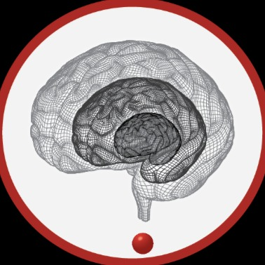

.. ConPagnon documentation master file, created by
   sphinx-quickstart on Tue Apr 23 17:08:01 2019.
   You can adapt this file completely to your liking, but it should at least
   contain the root `toctree` directive.

Welcome to ConPagnon !
=====================================

.. image:: images/logo/conpagnon_logo_horizontal_all_layers_flatten_png.png
   :target: https://github.com/ConPagnon/conpagnon
   :width: 40%
   :alt: conpagnon2.0
   :align: left

ConPagnon is python library designed to facilitate the analysis of Resting State data. ConPagnon
is mainly build around `Nilearn`_ and `Scikit-learn`_. We provide not only useful wrapper around
commonly used statistical method, but new algorithm build around state of the art metric, and
machine learning methods.

.. _Nilearn: https://nilearn.github.io/
.. _Scikit-learn: https://scikit-learn.org/stable/

.. toctree::
   :maxdepth: 1

   install
   contributing
   examples/index

Index
=====

:ref:`genindex`

:ref:`modindex`

